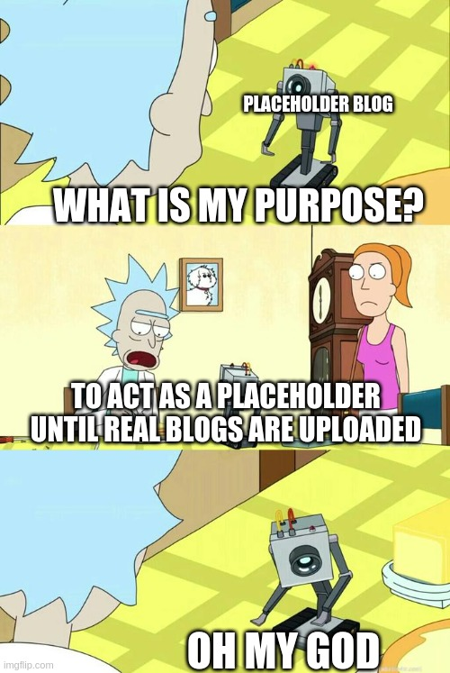

# Placeholder Blog

## What are placeholder blog?

Placeholder blog is the blog which is placed to show how the blog site/page will look like in the future when it is populated with actual real blogs. (I just made that defination)

This is used often in new blogs when the creator hasn't written any blog yet. You can think of it as a **lorem ipsum of a blog site**. (I guess, that's what I did.)

An example of a placeholder blog would be this blog. (Self refrencing blog, nice)

